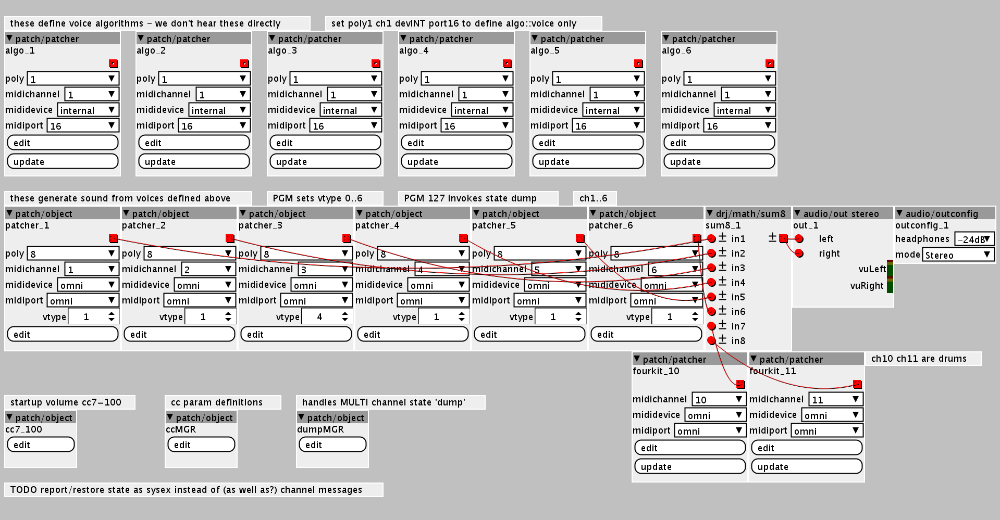
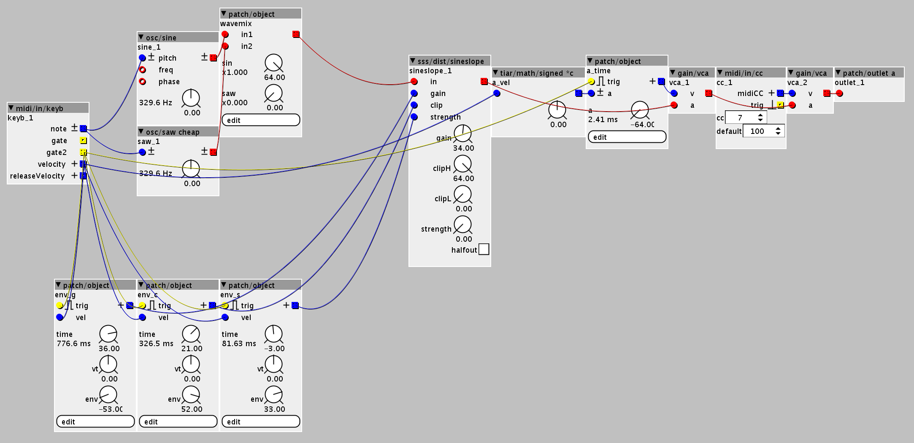

# AxoMulti
Multitimbral polyphonic synth for axoloti and ksoloti 1.0.12

Reminiscent of oldschool hardware synths like EVS-1, FB01, MT32 etc this is a multitimbral polysynth 'expander module' built with the [Axoloti platform by Johannes Taelman](https://github.com/axoloti/axoloti) and compatible with [Ksoloti platform](https://github.com/ksoloti].

Synth _'Engines'_ are assigned to MIDI channels 1..6 with eight polyphonic voices per channel. An additional set of drum voices bring the total polyphonic voices to at least 50 in the default configuration.

Synth engines include FM, PM, Waveshaping, Wavetable, Physical mudelling, and drum ROMpler types.

Realtime patch editing uses MIDI CONTROL CHANGE messages. A complete MULTI setup can be stored in a sequencer, as can expressive changes to patch parameters during realtime performance, or using CC automation. See [Midi Implementation](#midi-implementation) section below for more info.

# Installation and usage

Copy the .bin and .wav files to a microSD card, insert into hardware, switch on and enjoy the sounds. 😎
No card, no problem. Use editor `upload to internal flash` menu option for synthesis-only (drum channel 10 will simply be silent).

Voices have no release envelope, snap on and snap off, no CHANNEL or POLY AFTER TOUCH, PITCH BEND, nor MOD WHEEL support yet. Can you help?

# Compatibility and requirements

Development and extensive testing has been carried out with Axoloti and Ksoloti v1.0.12 firmware hardware and editor. You need a microSD card at least 1MByte in size for the drumkit wave ROM. 

# MIDI implementation

* Channels 1..6 may be configured as pitched voices, select engine with MIDI PROGRAM CHANGE.
* Channel 10 is always drumkit (if you have an SD card with wav files, silence otherwise).

* MIDI CONTROL CHANGE #7 sets channel volume on any supported channel
* MIDI PROGRAM CHANGE 0,1,2 etc selects the pitched voice engine
* MIDI PROGRAM CHANGE 127 invokes a response for all values for the selected voice engine

There are two versions in development, each with different sets of voice engines.

|Version 7a     |Description                    |
|---------------|-------------------------------|
|Voice engine 0 | idle, no DSP                  |
|Voice engine 1 | noisy shift register (MI)     |
|Voice engine 2 | feedback fm (MI)              |
|Voice engine 3 | sine waveshaper (SSS)         |
|Voice engine 4 | sine wavefolder (SSS)         |
|Voice engine 5 | asymmetrical sinefolder (SSS) |

|Version 6c     |Description                    |
|---------------|-------------------------------|
|Voice engine 0 | idle, no DSP                  |
|Voice engine 1 | fm (MI)                       |
|Voice engine 2 | sinefolder (MI)               |
|Voice engine 3 | wavetables (MI)               |
|Voice engine 4 | buzz (MI)                     |
|Voice engine 5 | noisy shift register (MI)     |
|Voice engine 6 | feedback fm (MI)              |

A consistent map of MIDI CONTROL CHANGE 16..31 is used for all pitched voice channels to configure parameters.
|CC#|Description               |
|---|--------------------------|
|07	|volume                    |
|16	|voice timbre              |
|17	|voice colour(if available)|
|18	|a time                    |
|19	|a vel-time                |
|20	|t time                    |
|21	|t vel+-                   |
|22	|t env                     |
|23	|c time     (if available) |
|24	|c vel-time (if available) |
|25	|c env      (if available) |
|26	|s time     (if available) |
|27	|s vel-time	(if available) |
|28	|s env      (if available) |
|29 |t set      (if available) |
|30 |c set      (if available) |
|31 |s set      (if available) |

# To build from source

The `xpatch.cpp` exported from editor v1.0.12 is provided.
The editor project `AxoMulti.axp` file(s) are also provided which require valid installation of the `axoloti-factory` and `axoloti-community` repositories as well as my very necessary modifications to the build configuration file `Makefile.patch`.

* ZPO-POLYFIX perl 's/find/replace/g' to optimise idle polyphonic voices
* ZPO-KVPLOMEM perl 's/find/replace/g' to omit KVP IPVP etc registration, saving SRAM
* gcc -O1 preferred optimisation, again saving SRAM

# Anything else I should know?

Yeah, unlike EVOLUTION EVS-1 behaviour, switching engine with a PROGRAM CHANGE initialises voice params. I would love to preserve parameter values across switching to easily answer the question _"I wonder what these parameter values would sound like on a different engine?"_... You can kinda work around this to capture a state dump in your sequencer and retransmit CONTROL CHANGE param values with a different PROGRAM CHANGE, but it's a bit of a faff.

I'm working on developing this to work with multiple Axoloti core boards as 'voice cards' with a master receiving MIDI channel messages and despatching to the voice cards, bussing audio outputs together. That'll be fun, but I'm not there yet. Can you help?

See my other axo/kso projects
 * [AxoPanelControls github repo](https://github.com/zenpho/AxoPanelControls) hastily constructed control panel for axoloti and ksoloti
